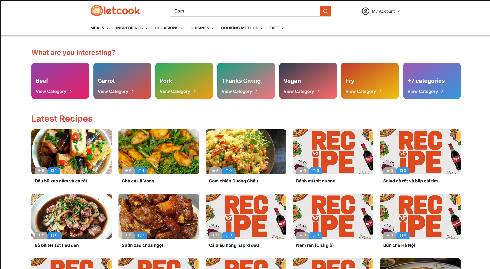
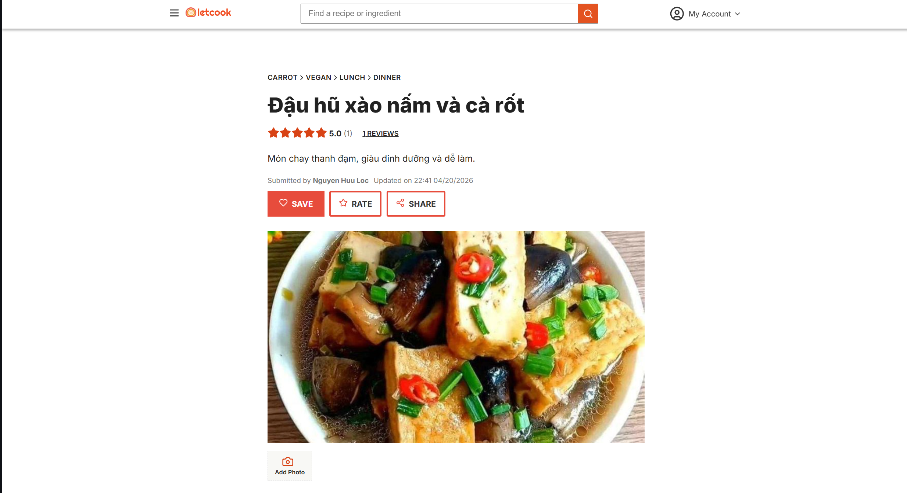
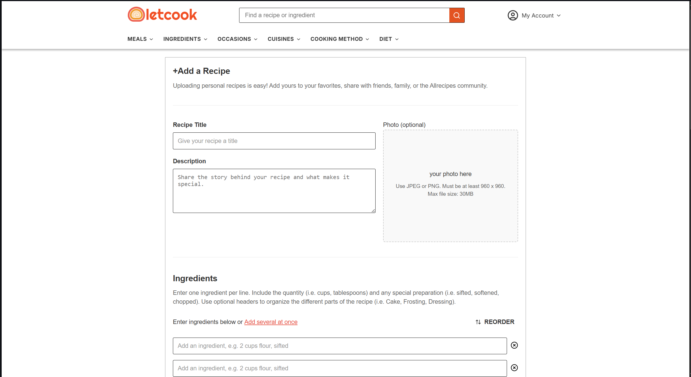
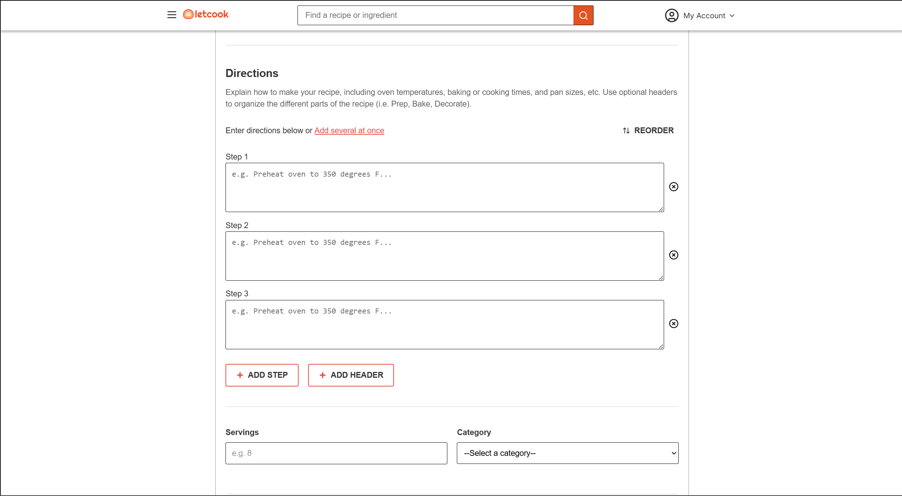
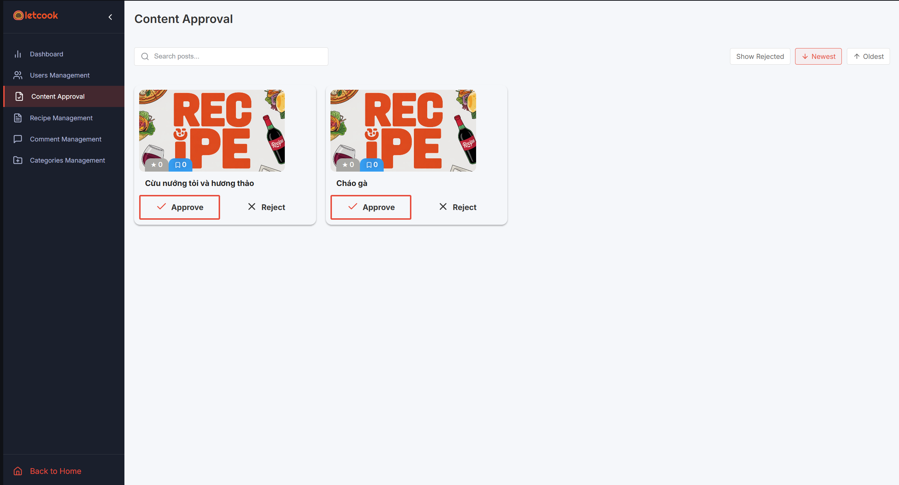
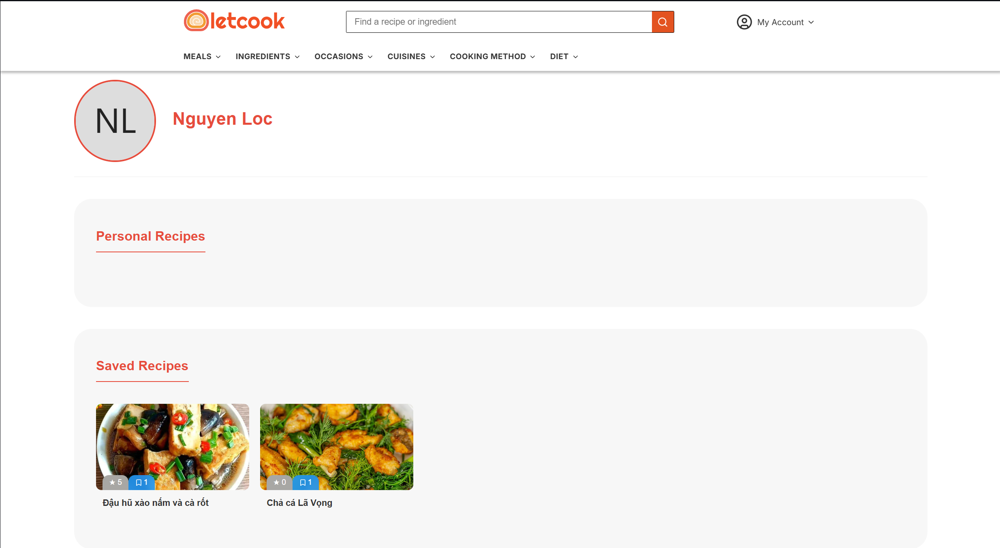
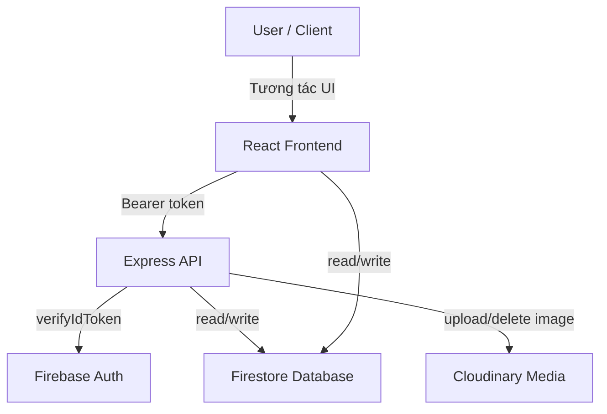

# ShareRecipes

## Giới thiệu tổng quan

**ShareRecipes** là ứng dụng web chia sẻ công thức nấu ăn hướng đến trải nghiệm người dùng và quy trình vận hành backend chặt chẽ. Dự án giải quyết bài toán:

- Quản lý nội dung công thức do người dùng tạo và duyệt bởi admin.
- Hỗ trợ lọc, tìm kiếm và xem chi tiết công thức với đánh giá, lượt lưu và phân loại chuyên sâu.
- Cung cấp luồng nghiệp vụ rõ ràng cho người dùng, tác giả, và quản trị viên.

Luồng nghiệp vụ cốt lõi:

1. Người dùng đăng ký/đăng nhập bằng Firebase Auth.
2. Tạo, sửa, xóa công thức và lưu lại công thức yêu thích.
3. Admin duyệt nội dung, quản lý danh mục và người dùng.
4. Review/đánh giá công thức được tính toán lại tự động để duy trì độ chính xác.

## Tính năng nổi bật (Core Features)

- **Đăng nhập/Đăng ký bảo mật** với Firebase Authentication.
- **Quản lý công thức nấu ăn**: tạo, sửa, xóa, lưu công thức và duyệt theo danh mục.
- **Hệ thống review**: người dùng đánh giá, xem thống kê sao và bình luận.
- **Admin dashboard**: duyệt nội dung pending, phê duyệt bài, từ chối và quản lý người dùng.
- **Quản lý danh mục**: thêm, sửa, xóa category cùng batch cập nhật recipe liên quan.
- **Ảnh và media**: upload ảnh recipe bằng Cloudinary, xóa ảnh kèm theo khi xoá recipe.

### Minh họa giao diện

- Trang chủ & tìm công thức
  

- Chi tiết công thức & review
  
  

- Tạo / chỉnh sửa công thức
  
  

- Admin duyệt nội dung
  

- Hồ sơ người dùng
  

## Công nghệ sử dụng (Tech Stack)

### Backend

- Node.js, Express.js
- Firebase Admin SDK & Firestore
- Firebase Authentication
- Cloudinary
- Joi (validate request)
- express-fileupload, cors, dotenv

### Frontend

- React.js
- React Router v7
- React Hook Form
- Semantic UI React, Bootstrap, Swiper
- Axios
- React Quill

### Database

- Firebase Firestore
- Firebase Authentication

## Kiến trúc hệ thống (System Architecture)

Ứng dụng được thiết kế theo mô hình client-server rõ ràng với:

- `frontend/`: giao diện React chịu trách nhiệm hiển thị, điều hướng và liên hệ API.
- `backend/`: API RESTful Express xử lý xác thực, phân quyền, xử lý dữ liệu, và tương tác Firestore.
- `config/firebase.js`: quản lý Firebase Admin, xác thực token, truy cập Firestore.
- `services/`: tách riêng logic truy vấn dữ liệu, thao tác Firestore, Cloudinary và business logic.
- `controllers/`: nhận request, chuyển vào service, trả response chuẩn.
- `middlewares/`: xác thực JWT, gán dữ liệu user và kiểm tra quyền (admin, author).

### Luồng giao tiếp chính

> Lưu ý: Mặc dù mô hình có Firebase Auth/Firestore, backend vẫn vận hành như một lớp API riêng biệt để xử lý xác thực, quyền truy cập và logic nghiệp vụ.

## Cơ sở dữ liệu (Database Schema)

Các thực thể chính và quan hệ:

- `users`
  - `uid`, `email`, `displayName`, `photoURL`, `role` (`user` / `admin`), `banned`, `recipeCount`, `createdAt`.
  - Quan hệ 1:N với `recipes` và `reviews`.

- `recipes`
  - `title`, `titleLowercase`, `description`, `ingredients`, `instructions`, `categories` (array), `imageUrl`, `imagePublicId`, `totalTime`, `averageRating`, `saveCount`, `status` (`pending`, `approved`, `reject`), `userId`, `createdAt`, `updatedAt`.
  - Liên kết đến tác giả (`userId`) và nhiều `reviews`.

- `categories`
  - `name`, `type`, `modifyAt`.
  - Dùng `array-contains` để ánh xạ nhiều recipe.

- `reviews`
  - `recipeId`, `authorId`, `rating`, `content`, `createdAt`.
  - Mỗi review cập nhật lại `averageRating` và `totalReview` của recipe.

### Tính toán nghiệp vụ chính

- Phân trang Firestore thông minh với `limit + 1` để xác định trang kế tiếp.
- Tính `averageRating` trên review mỗi lần thêm, sửa, hoặc xóa review.
- Xử lý rollback/cleanup ảnh Cloudinary khi xóa recipe.
- Cập nhật `recipeCount` của user khi thêm/xóa recipe.

## Tài liệu API (API Documentation)

Hiện tại dự án không triển khai Swagger/OpenAPI trong mã nguồn. Dưới đây là bảng tóm tắt các endpoints quan trọng nhất.

| Phương thức | Endpoint                            | Xác thực             | Chức năng                                               |
| ----------- | ----------------------------------- | -------------------- | ------------------------------------------------------- |
| POST        | `/api/auth/register`                | No                   | Đăng ký tài khoản mới với Firebase Auth                 |
| POST        | `/api/auth/verify-token`            | Bearer token         | Kiểm tra token JWT hợp lệ                               |
| GET         | `/api/recipes`                      | No                   | Lấy danh sách recipe, hỗ trợ filter, search, pagination |
| GET         | `/api/recipes/:recipeId`            | No                   | Lấy chi tiết recipe                                     |
| POST        | `/api/recipes`                      | Bearer token         | Tạo recipe mới                                          |
| PUT         | `/api/recipes/:recipeId`            | Bearer token         | Sửa recipe (author/admin)                               |
| DELETE      | `/api/recipes/:recipeId`            | Bearer token         | Xóa recipe (author/admin)                               |
| POST        | `/api/recipes/save/:recipeId`       | Bearer token         | Lưu recipe yêu thích                                    |
| DELETE      | `/api/recipes/unsave/:recipeId`     | Bearer token         | Bỏ lưu recipe                                           |
| GET         | `/api/recipes/personal/:uid`        | No                   | Lấy recipe do user tạo                                  |
| GET         | `/api/recipes/save/:uid`            | No                   | Lấy recipe user đã lưu                                  |
| GET         | `/api/recipes/save/count/:recipeId` | No                   | Lấy số lượt lưu của recipe                              |
| GET         | `/api/recipes/admin/pending`        | Bearer token + admin | Lấy danh sách recipe chờ duyệt                          |
| PUT         | `/api/recipes/admin/status`         | Bearer token + admin | Cập nhật trạng thái duyệt recipe                        |
| GET         | `/api/categories`                   | No                   | Lấy danh sách category                                  |
| GET         | `/api/categories/:categoryId`       | No                   | Lấy recipe theo category                                |
| GET         | `/api/users/:uid`                   | No                   | Lấy thông tin user                                      |
| PUT         | `/api/users/:uid`                   | Bearer token         | Cập nhật profile (chủ tài khoản hoặc admin)             |
| GET         | `/api/users/check-exists?email=...` | No                   | Kiểm tra email đã tồn tại                               |
| GET         | `/api/users/admin/all`              | Bearer token + admin | Lấy danh sách người dùng                                |
| PUT         | `/api/users/ban/:userId`            | Bearer token + admin | Bật/tắt status banned                                   |
| GET         | `/api/reviews`                      | Bearer token + admin | Lấy toàn bộ review                                      |
| GET         | `/api/reviews/my/:recipeId`         | Bearer token         | Lấy review của user hiện tại cho recipe                 |
| POST        | `/api/reviews`                      | Bearer token         | Thêm review mới                                         |
| GET         | `/api/reviews/recipe?recipeId=...`  | No                   | Lấy review theo recipe                                  |
| PUT         | `/api/reviews/:reviewId`            | Bearer token         | Cập nhật review (author/admin)                          |
| DELETE      | `/api/reviews/:reviewId`            | Bearer token         | Xóa review (author/admin)                               |
| GET         | `/api/reviews/stats/:recipeId`      | No                   | Lấy thống kê review của recipe                          |
| POST        | `/api/cloudinary/upload`            | Bearer token         | Upload ảnh media lên Cloudinary                         |

## Hướng dẫn nhanh

1. **Backend**
   - Chạy `npm install` trong `backend/`
   - Tạo `.env` với biến `FIREBASE_PROJECT_ID`, `FIREBASE_CLIENT_EMAIL`, `FIREBASE_PRIVATE_KEY`, `CLOUDINARY_CLOUD_NAME`, `CLOUDINARY_API_KEY`, `CLOUDINARY_API_SECRET`
   - Khởi chạy với `npm start`

2. **Frontend**
   - Chạy `npm install` trong `frontend/`
   - Khởi chạy với `npm start`
